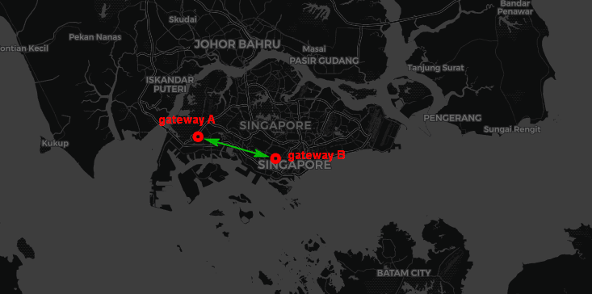

# QSG-Topographic-Map

### Introduction

This project will create a map panel to show gateway devices' communication situation topographic. It is is a sub-project of the ‘QSG-Manager dashboard’ (Quantum Safe Gateway Manager) project. In the main ‘Quantum Safe Gateway’ project, there will be several gateway devices communicating with each other. QSG-Manager will collect and monitor the internal status of our gateway devices and visualize all the data. In this assignment project, we will develop a topographic map panel to show the geo-location of all the gateway devices and the dataflow situation among them.

Assume we have two gateway devices (gateway A and B) deployed in NTU and NUS. When these two gateways are communicating with each other, on the topographic map panel we will mark these two gateway GPS position on the map and draw a link between the 2 markers:



###### Gateway devices communication situation topographic page

Users are able to interact with the map by clicking on a marker for a popup showing the full details of gateway throughput and data rate between the 2 gateways.

There is also a sidebar attached beside the map which allow users to decide various map settings. They can choose the data-uptake rate of the flask webserver calling GET request to the QSG-Manager through a dropdown menu. A filter function is also added to only display certain types of communication links (active, gateway, control hub).


###### The main workflow for the program


###### The main work flow for flaskMap_v02.py


------

### Program Setup

###### Development Environment 

Python3.7.4, HTML+flask, socketIO+eventlet, SQLite3

###### Additional Lib/Software Need

1. python Flask :

   ```
   pip3 install Flask
   ```

2. flask-googlemaps 0.4.0

   ```
   pip3 install flask-googlemaps
   ```

3. flask-socketIO 4.5.1

   ```
   pip3 install flask-socketio
   ```

4. python eventlet

   ```
   pip3 install eventlet
   ```

###### Program File List

| Program File      | Execution Env | Description                                                  |
| ----------------- | ------------- | ------------------------------------------------------------ |
| flaskMap_v02.py   | python3       | This module is used create flask webserver to send GET request with the QSG-Manager. |
| qsg_v03.py        | python3       | This module is used retrieve data from the QSG-Manager Dashboard database.
| globalVal.py      | python3       | This module stores all the global variables used in the flask webserver. |
| index_v02.html    | HTML          | This file generates the UI of the Topological Maps using Google Maps. |
| maps.js           | JavaScript    | This module stores the static JS functions to run the Google Map. |
| map.css           | CSS           | This is the stylesheet for the Topological Map. |

------

### Program Usage

Program execution cmd : 

1. Start up the test case QSG-Manager to query the 'QSG-Manager Dashboard' database and retrieve the gateway communication information
   ```
   python3 qsg_v03.py
   ```

2. Run the flask webserver to retrieve data from the QSG-Manager
   ```
   python3 flaskMap_v02.py
   ```

3. Open web browser and enter URL: http://127.0.0.1:5001


------

### Todo List

- [x] Design a web-page to show the gateway devices communication situation topographic on a map.
- [x] Design a back-End web-server program to accept the gateway data from the QSG-Manage and update the webpage.
- [x] Refactor the code to include database queries to retrieve and parse communication data.
- [x] Create program development and environment setup documents.

Timeline: 

> Week 1: Improve the program design document and fixed what kind of API/Program language we will be used for the program development.
>
> Week 2: Pick up the related API and programming knowledge; create some simple test program during leaning.
>
> Week 3: Start programming and continues knowledge learning if needed.
>
> Week 4-7: Program development and improvement.
>
> Week 8-9: Program improvement and add new features.
>
> Week 10-12: Write program design and setup document.


------

> Last edited by NgZhaoMing(ngzhaoming@gmail.com) at 20/07/2020